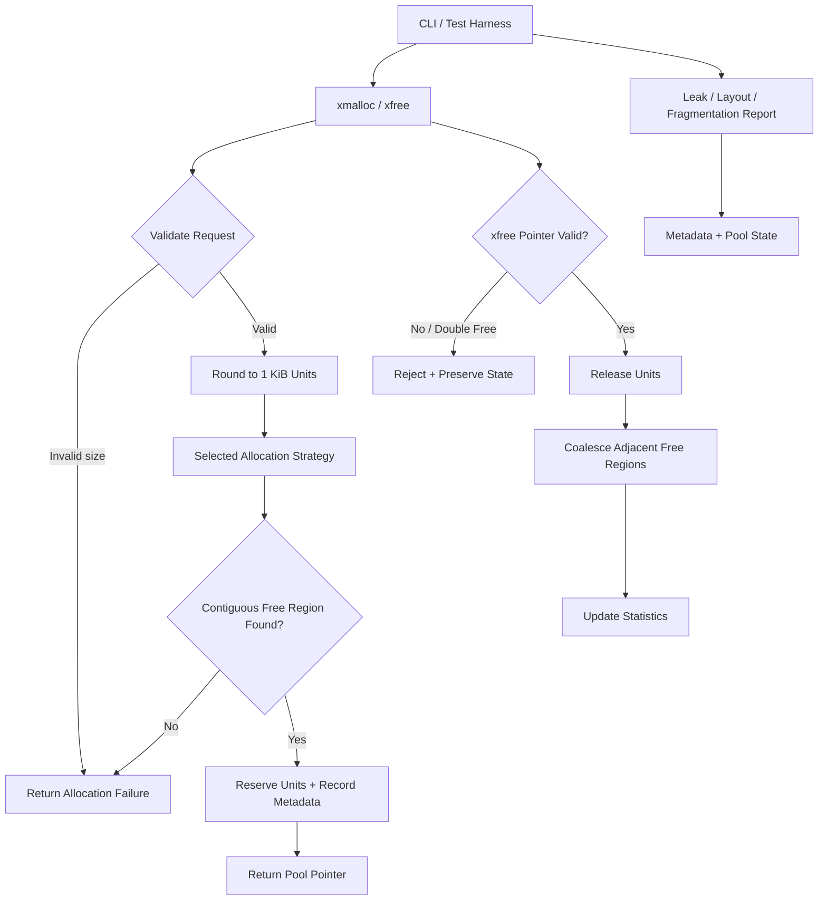

1. System Flow

2. Data / Storage Design
- Pool: fixed 2 MiB region, logically divided into 2048 contiguous 1 KiB units.
- Metadata: fixed-size externally allocated/static descriptors representing allocation state; no STL container is required for allocator state.
- Allocation metadata: starting unit, unit count, requested byte count, allocation identifier, and allocation state.
- Free-space state: represented through unit/block metadata; allocation searches contiguous free runs and deallocation coalesces adjacent free runs.
- Diagnostics: derive active allocations, allocated/free units, largest free region, internal waste, reuse information, and fragmentation from allocator state.
- Pool ownership: xmalloc()/xfree() operate on the custom pool; the system allocator is not used to satisfy individual user requests.
- PostgreSQL: Not required for this problem.
3. Core Interfaces
- initialize_pool() → initializes the 2 MiB pool and metadata; returns initialization status.
- xmalloc(size_t bytes) → rounds request to 1 KiB units, selects the configured strategy, records metadata, and returns a pool pointer or failure.
- xfree(void* ptr) → validates ownership/allocation state, releases units, coalesces free regions, and reports invalid/double-free errors safely.
- set_allocation_strategy(strategy) → selects First-Fit or Best-Fit through a common strategy contract.
- get_allocator_stats() → returns allocation/free/reuse/fragmentation metrics for diagnostics and benchmarking.
- dump_leaks() → reports active allocations with allocation ID, starting unit, requested size, and reserved units.
Auth: Not required for MVP.
4. User/System Interfaces
- CLI demo → executes deterministic allocation, free, fragmentation, reuse, and failure scenarios.
- CLI strategy selection → runs identical workloads using First-Fit or Best-Fit.
- CLI statistics report → displays allocated/free units, largest free region, and fragmentation/reuse metrics.
- CLI leak report → displays allocations still active at inspection time.
- Automated test harness → validates normal, boundary, invalid-input, exhaustion, and fragmentation behavior.
- Benchmark runner → executes reproducible workloads and reports measured strategy behavior without inventing performance claims.
5. Fallback Strategy
- Invalid size, oversized request, or no suitable contiguous region → detect during validation/search → return allocation failure without modifying allocator state.
- Invalid pointer or double free → validate pool ownership and allocation metadata → reject operation and preserve existing allocations.
- Strategy/benchmark failure or incomplete optional feature → detect through tests/build validation → retain the tested First-Fit allocator as the minimum working allocation path.
6. Tech Debt Accepted
- Variable-byte-granularity allocation and a full standards-compatible malloc() replacement are out of scope; the MVP uses the specified 1 KiB granularity.
- Thread safety is deferred because it is not explicitly required; concurrency is not part of judging MVP scope.
- Buddy allocation, advanced free-space indexes, and sophisticated visualization are deferred to avoid compromising the 12-hour correctness path.

7. Embedded Workload Demonstration Layer
- Realistic controller / gateway memory consumer simulation built on top of the public xmalloc()/xfree() allocator contract.
- Models 5 realistic components: Sensor Buffer (12 KiB), Communication RX (32 KiB), Control Task (8 KiB), Event Buffer (6 KiB), and Temporary Processing Buffer (20 KiB).
- Includes a deterministic Memory Pressure Indicator (LOW, MODERATE, HIGH, CRITICAL) derived from live pool occupancy, largest contiguous free capacity, and allocation failure counters.
- Demonstrates reproducible lifecycle phases: startup, transient operation, selective release/fragmentation, deterministic reuse, bidirectional coalescing, controlled pool exhaustion, and complete recovery.
- Prototype simulation designed for hackathon demonstration; not a claim of safety certification or deployment in commercial flight hardware.