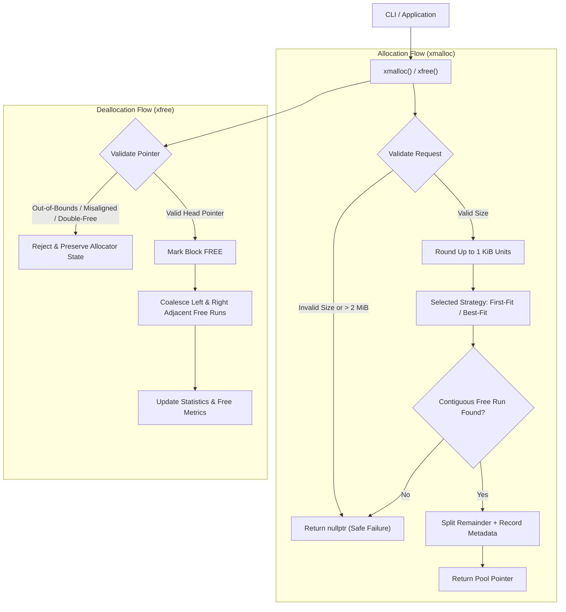

# C-002: Deterministic Custom Memory Allocator

A deterministic C++ custom memory allocator managing a fixed **2 MiB** pool logically partitioned into **2048 × 1 KiB** contiguous allocation units. Built with configurable allocation strategies (**First-Fit** and **Best-Fit**), bidirectional free-block coalescing, memory leak detection, detailed fragmentation diagnostics, a **Tier-2 Deterministic Allocation Strategy Advisor**, and an interactive/demonstration CLI harness.

---

## 🚀 Key Features

- **Fixed 2 MiB Pool (2048 × 1 KiB Units)**: Operates independently of the system heap for user allocation requests.
- **External Metadata Architecture**: Descriptors are maintained externally, guaranteeing that 100% of the 2 MiB pool remains available for user payloads.
- **1 KiB Allocation Granularity**: Incoming allocation byte requests are automatically rounded up to discrete 1 KiB unit boundaries.
- **Configurable Search Strategies**:
  - **First-Fit**: Scans from the beginning of the pool to find the first suitable contiguous block (lowest search overhead).
  - **Best-Fit**: Evaluates candidate free blocks to find the closest matching block size, minimizing remaining fragment slack.
- **Tier-2 WOW Feature: Deterministic Allocation Strategy Advisor**:
  - Runs identical deterministic workloads across First-Fit and Best-Fit strategies.
  - Measures allocation success rate, search work (block evaluations), fragmentation ratios, internal slack waste, and reuse events.
  - Outputs an evidence-based trade-off comparison and recommendation without heuristics or fake AI.
- **Splitting & Coalescing**:
  - **Block Splitting**: Partitions excess units from oversized free blocks into new free descriptor records.
  - **Bidirectional Coalescing**: Automatically merges adjacent free blocks (left and right) upon deallocation to eliminate external fragmentation.
- **Deterministic Memory Reuse**: Validated reclamation and re-allocation of freed blocks without pool drift.
- **Safety & Error Handling**:
  - **Boundary Checks**: Validates that all pointers belong to the managed 2 MiB pool.
  - **Alignment Validation**: Enforces 1 KiB unit alignment.
  - **Double-Free Rejection**: Safely identifies and rejects attempts to free already-freed or non-head pointers without corrupting state.
  - **Controlled Exhaustion**: Gracefully returns `nullptr` when no contiguous region satisfies the request.
- **Comprehensive Diagnostics & Leak Detection**:
  - Computes internal slack waste (bytes) and external fragmentation indicator.
  - Generates live memory leak reports with block ID, requested vs reserved bytes, and address offsets.
  - ASCII visual memory bar representing real-time pool occupancy.
- **Cross-Platform / Linux-Ready Build**: Dual-OS POSIX & Windows compliant Makefile.
- **Automated Test Suite & Benchmarks**: 55 automated unit tests covering all edge cases, plus comparative benchmark runners.

---

## 🏗️ Architecture Overview



### Memory Layout & Formulas
- **Pool Size**: 2,097,152 bytes (2 MiB).
- **Unit Size**: 1,024 bytes (1 KiB).
- **Total Units**: 2,048 units.
- **Internal Slack Waste**: $\sum (\text{Reserved Bytes} - \text{Requested Bytes})$ across active allocations.
- **External Fragmentation Indicator**: $1.0 - \left(\frac{\text{Largest Free Block Units}}{\text{Total Free Units}}\right)$ when total free units $> 0$, and $0.0$ otherwise.

---

## 📁 Project Structure

```text
PS-C-002/
├── include/
│   ├── allocator.h          # Public API, CustomPoolAllocator, and Advisor declarations
│   ├── allocator_types.h    # Data structures, constants, stats, Advisor types, and leak definitions
│   └── strategy.h           # IAllocationStrategy, FirstFitStrategy, and BestFitStrategy
├── src/
│   ├── allocator.cpp        # Pool memory management, xmalloc/xfree, splitting, coalescing
│   ├── strategy.cpp         # First-Fit and Best-Fit search implementations
│   ├── diagnostics.cpp      # Layout mapping, stats computation, leak reporting, and Strategy Advisor
│   └── main.cpp             # 10-step sequential demo suite and interactive console
├── tests/
│   └── test_allocator.cpp   # 55-test automated unit and regression suite
├── benchmarks/
│   └── benchmark.cpp        # Reproducible First-Fit vs Best-Fit benchmark harness
├── ARCHITECTURE.md          # Technical baseline architecture specification
├── PRD.md                   # Product requirements document
├── PROGRESS.md              # Task execution tracking and decisions log
├── Makefile                 # Cross-platform (Linux & Windows) build definitions
├── .gitignore               # Git ignore rules
└── README.md                # Project documentation
```

---

## 🛠️ Building & Running

### Prerequisites
- **C++ Compiler**: GCC / MinGW with C++14 support (`g++`).
- **Make Tool**: `make` (Linux/macOS) or `mingw32-make` (Windows).

### Build All Targets
```bash
make all        # Linux / macOS
# or
mingw32-make all # Windows
```

### Run Automated Unit Tests (55 Tests)
```bash
make test        # Linux / macOS
# or
mingw32-make test # Windows
```
*Executes all 55 unit test assertions covering initialization, unit rounding, splitting, coalescing, reuse, exhaustion, invalid pointer checks, double free detection, strategy variations, leak reports, and Tier-2 Strategy Advisor validation.*

### Run Strategy Comparison Benchmarks
```bash
make bench        # Linux / macOS
# or
mingw32-make bench # Windows
```
*Compares First-Fit vs Best-Fit across fragmented churn and burst allocation cycles, reporting execution time, allocation success rates, strategy search steps, and external fragmentation.*

### Run Tier-2 Strategy Advisor Report
```bash
./bin/demo_runner --advisor        # Linux / macOS
# or
bin\demo_runner.exe --advisor      # Windows
```

### Run Full 10-Step Deterministic Demo
```bash
make cli        # Linux / macOS
# or
mingw32-make cli # Windows
```

### Run Interactive Console
```bash
./bin/demo_runner --interactive    # Linux / macOS
# or
bin\demo_runner.exe --interactive  # Windows
```

---

## 💻 Interactive Console Commands

When running in `--interactive` mode, the allocator provides an interactive command-line shell:

| Command | Description | Example |
| :--- | :--- | :--- |
| `alloc <bytes>` | Allocate `<bytes>` from the pool | `alloc 4096` |
| `free <handle_id>` | Free an allocated block by its handle ID | `free 1` |
| `strategy <ff\|bf>` | Switch active strategy (`ff` = First-Fit, `bf` = Best-Fit) | `strategy bf` |
| `advisor [churn\|burst]` | Run Tier-2 Deterministic Strategy Advisor | `advisor churn` |
| `layout` | Display visual ASCII layout map and block descriptors | `layout` |
| `stats` | Print comprehensive allocator statistics | `stats` |
| `leaks` | Run live memory leak detection report | `leaks` |
| `list` | List all active tracked handles | `list` |
| `reset` | Reset pool to clean initial state | `reset` |
| `demo` | Run the full 10-step automated demo | `demo` |
| `exit` / `quit` | Exit the interactive console | `exit` |

---

## 📊 Strategy Advisor Output Example

```text
============================================================
ALLOCATOR STRATEGY ANALYSIS
============================================================

Workload: Fragmented Churn Pattern
Requests: 400

Metric                  First-Fit         Best-Fit          
------------------------------------------------------------
Successful allocations  359               362               
Failed allocations      41                38                
Search work (steps)     56027             55608             
Total free              116 KiB           48 KiB            
Largest free region     5 KiB             4 KiB             
Fragmentation           95.69 %           91.67 %           
Internal slack waste    120583 B          121585 B          
Reuse events            118               121               
------------------------------------------------------------
Observed result:
Best-Fit achieved a higher allocation success rate (362/400 vs 359/400) and lower external fragmentation (91.7% vs 95.7%).

Trade-off:
Best-Fit tightly matches free block sizes, minimizing residue fragmentation and preserving larger contiguous runs. However, Best-Fit evaluates all candidate blocks in the list (search work: 55608 steps vs 56027 steps for First-Fit). Recommendation: Use Best-Fit for memory-constrained heterogeneous workloads where allocation success rate is critical.
============================================================
```

---

## 🔍 Core API Reference

```cpp
#include "allocator.h"

// Pool lifecycle
bool initialize_pool();
void shutdown_pool();
void reset_pool();

// Allocation and Deallocation
void* xmalloc(size_t bytes);
bool xfree(void* ptr);

// Strategy Configuration
void set_allocation_strategy(AllocationStrategy strategy); // FIRST_FIT or BEST_FIT
AllocationStrategy get_allocation_strategy();

// Diagnostics & Reports
AllocatorStats get_allocator_stats();
void dump_leaks();
void dump_pool_layout();
std::vector<LeakInfo> get_active_leaks();

// Tier-2 Strategy Advisor
StrategyAdvisorReport run_strategy_advisor(const std::string& workload_type = "fragmented_churn");
void print_strategy_advisor_report(const StrategyAdvisorReport& report);
```
