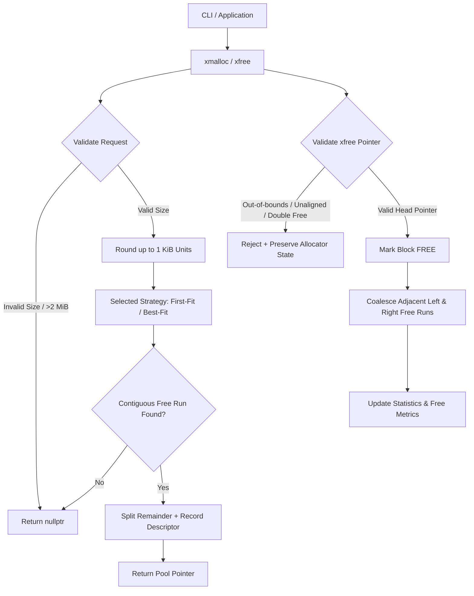

# C-002: Deterministic Custom Memory Allocator

A high-performance, deterministic C++ custom memory allocator managing a fixed **2 MiB** pool logically partitioned into **2048 × 1 KiB** contiguous allocation units. Built with configurable allocation strategies (**First-Fit** and **Best-Fit**), bidirectional free-block coalescing, memory leak detection, detailed fragmentation diagnostics, and an interactive/demonstration CLI harness.

---

## 🚀 Key Features

- **Fixed 2 MiB Pool (2048 × 1 KiB Units)**: Operates independently of the system heap for user allocation requests.
- **External Metadata Architecture**: Descriptors are maintained externally, guaranteeing that 100% of the 2 MiB pool remains available for user payloads.
- **1 KiB Allocation Granularity**: Incoming allocation byte requests are automatically rounded up to discrete 1 KiB unit boundaries.
- **Configurable Search Strategies**:
  - **First-Fit**: Scans from the beginning of the pool to find the first suitable contiguous block.
  - **Best-Fit**: Evaluates candidate free blocks to find the closest matching block size, minimizing remaining fragment slack.
- **Splitting & Coalescing**:
  - **Block Splitting**: Partitions excess units from oversized free blocks into new free descriptor records.
  - **Bidirectional Coalescing**: Automatically merges adjacent free blocks (left and right) upon deallocation to eliminate external fragmentation.
- **Deterministic Memory Reuse**: Validated reclamation and re-allocation of freed blocks without pool drift.
- **Safety & Error Handling**:
  - **Boundary Checks**: Validates that all pointers belong to the managed 2 MiB pool.
  - **Alignment Validation**: Enforces 1 KiB unit alignment.
  - **Double-Free Rejection**: Safely identifies and rejects attempts to free already-freed or non-head pointers without corrupting state.
  - **Controlled Exhaustion**: Gracefully returns `nullptr` when no contiguous region satisfies the request.
- **Comprehensive Diagnostics & Leak Detection**:
  - Computes internal slack waste (bytes) and external fragmentation percentage.
  - Generates live memory leak reports with block ID, requested vs reserved bytes, and address offsets.
  - ASCII visual memory bar representing real-time pool occupancy.
- **Automated Test Suite & Benchmarks**: 47 automated unit tests covering all edge cases, plus comparative benchmark runners.

---

## 🏗️ Architecture Overview



### Memory Layout
- **Pool Size**: 2,097,152 bytes (2 MiB).
- **Unit Size**: 1,024 bytes (1 KiB).
- **Total Units**: 2,048 units.
- **Internal Fragmentation Metric**: $\sum (\text{Reserved Bytes} - \text{Requested Bytes})$ across active allocations.
- **External Fragmentation Metric**: $1.0 - \left(\frac{\text{Largest Free Block Units}}{\text{Total Free Units}}\right)$ when free units $> 0$.

---

## 📁 Project Structure

```text
PS-C-002/
├── include/
│   ├── allocator.h          # Public API and CustomPoolAllocator class declaration
│   ├── allocator_types.h    # Data structures, constants, stats, and leak definitions
│   └── strategy.h           # IAllocationStrategy, FirstFitStrategy, and BestFitStrategy
├── src/
│   ├── allocator.cpp        # Pool memory management, xmalloc/xfree, splitting, coalescing
│   ├── strategy.cpp         # First-Fit and Best-Fit search implementations
│   ├── diagnostics.cpp      # Layout mapping, stats computation, and leak reporting
│   └── main.cpp             # CLI demo suite and interactive console
├── tests/
│   └── test_allocator.cpp   # 47-test automated unit and regression suite
├── benchmarks/
│   └── benchmark.cpp        # Reproducible First-Fit vs Best-Fit benchmark harness
├── ARCHITECTURE.md          # Technical baseline architecture specification
├── PRD.md                   # Product requirements document
├── PROGRESS.md              # Task execution tracking and decisions log
├── Makefile                 # MinGW / GCC build definitions
├── .gitignore               # Git ignore rules
└── README.md                # Project documentation
```

---

## 🛠️ Building & Running

### Prerequisites
- **C++ Compiler**: GCC / MinGW with C++14 support (`g++`).
- **Make Tool**: `mingw32-make` (Windows) or `make` (Linux/macOS).

### Build All Targets
```bash
mingw32-make all
```

### Run Automated Unit Tests
```bash
mingw32-make test
```
*Executes all 47 unit test assertions covering initialization, unit rounding, splitting, coalescing, reuse, exhaustion, invalid pointer checks, double free detection, strategy variations, and leak reports.*

### Run Strategy Comparison Benchmarks
```bash
mingw32-make bench
```
*Compares First-Fit vs Best-Fit across fragmented churn and burst allocation cycles, reporting execution time, allocation success rates, strategy search steps, and external fragmentation.*

### Run CLI Automated Demo
```bash
mingw32-make cli
# Or directly:
bin/allocator_cli.exe --demo
```

### Run Interactive Console
```bash
bin/allocator_cli.exe --interactive
```

---

## 💻 Interactive Console Commands

When running in `--interactive` mode, the allocator provides an interactive command-line shell:

| Command | Description | Example |
| :--- | :--- | :--- |
| `alloc <bytes>` | Allocate `<bytes>` from the pool | `alloc 4096` |
| `free <handle_id>` | Free an allocated block by its handle ID | `free 1` |
| `strategy <ff\|bf>` | Switch active strategy (`ff` = First-Fit, `bf` = Best-Fit) | `strategy bf` |
| `layout` | Display visual ASCII layout map and block descriptors | `layout` |
| `stats` | Print comprehensive allocator statistics | `stats` |
| `leaks` | Run live memory leak detection report | `leaks` |
| `list` | List all active tracked handles | `list` |
| `reset` | Reset pool to clean initial state | `reset` |
| `demo` | Run the automated 5-scenario demo | `demo` |
| `exit` / `quit` | Exit the interactive console | `exit` |

---

## 📊 Benchmark Summary

Example benchmark output comparing strategies on synthetic workloads:

```text
========================================================================================================
                                  BENCHMARK PERFORMANCE COMPARISON                                      
========================================================================================================
Workload                    Strategy      Time (ms)     Success / Fail  Search Steps    Frag (%)        Largest Free  
--------------------------------------------------------------------------------------------------------
Fragmented Churn (400 ops)  First-Fit     0.000         359 / 41        56027           95.69           5 KiB         
Fragmented Churn (400 ops)  Best-Fit      0.000         362 / 38        55608           91.67           4 KiB         
Burst Alloc/Free Cycles     First-Fit     0.000         250 / 0         6375            0.00            2048 KiB      
Burst Alloc/Free Cycles     Best-Fit      0.000         250 / 0         6375            0.00            2048 KiB      
========================================================================================================
```

---

## 🔍 Core API Reference

```cpp
#include "allocator.h"

// Pool lifecycle
bool initialize_pool();
void shutdown_pool();
void reset_pool();

// Allocation and Deallocation
void* xmalloc(size_t bytes);
bool xfree(void* ptr);

// Strategy Configuration
void set_allocation_strategy(AllocationStrategy strategy); // FIRST_FIT or BEST_FIT
AllocationStrategy get_allocation_strategy();

// Diagnostics & Reports
AllocatorStats get_allocator_stats();
void dump_leaks();
void dump_pool_layout();
std::vector<LeakInfo> get_active_leaks();
```
